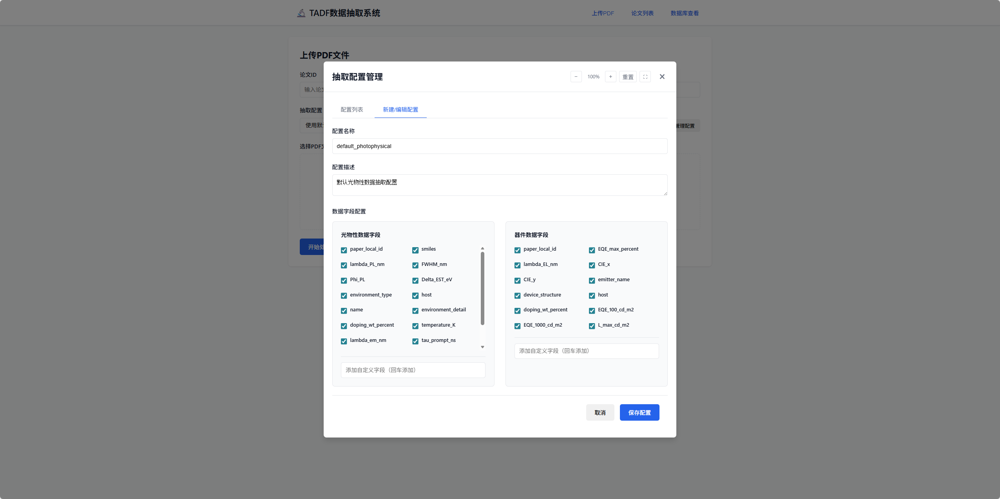
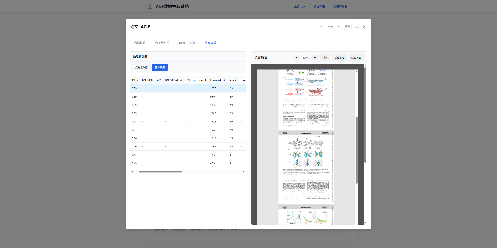
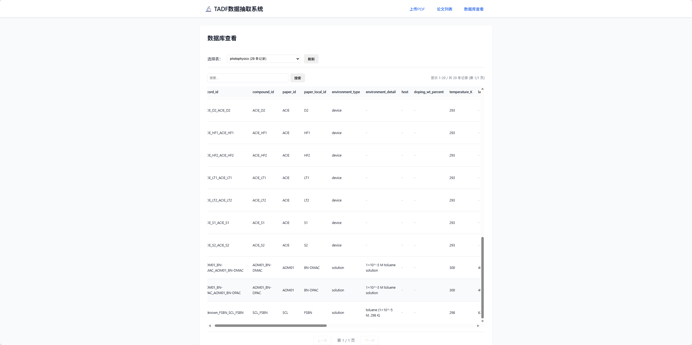

# TADF数据抽取系统

从TADF文献PDF到机器学习可用数据集的自动化流水线系统。

## 项目简介

本项目实现了从TADF（热活化延迟荧光）文献PDF中自动抽取分子结构、光物性数据和器件性能数据的完整流水线，最终构建可用于机器学习的高质量数据集。

### 核心功能

1. **文献预处理**：使用MinerU将PDF转为结构化JSON + 图片
2. **图像分类**：使用Qwen-VL对图片进行多模态分类，识别分子结构图
3. **结构识别**：使用DECIMER将分子结构图转为SMILES
4. **数据抽取**：使用LLM（Qwen）从表格和文本中抽取光物性和器件数据
5. **实体对齐**：建立统一的化合物ID体系，关联所有数据
6. **质量控制**：自动规则验证 + LLM审核
7. **数据集导出**：面向不同ML任务的专用数据视图

## 项目结构

```
tadf_data_extraction/
├── config.py                      # 配置文件
├── main.py                        # 主流程入口
├── requirements.txt               # 依赖包
├── README.md                      # 本文件
│
├── data/                          # 数据目录
│   ├── raw_pdfs/                  # 原始PDF文件
│   ├── mineru_output/             # MinerU输出
│   ├── processed/                 # 处理结果
│   └── database/                  # 数据库文件
│
├── logs/                          # 日志目录
│
├── utils/                         # 工具模块
│   ├── __init__.py
│   └── logger.py                  # 日志工具
│
└── modules/                       # 核心模块
    ├── __init__.py
    ├── mineru_processor.py        # MinerU处理器
    ├── paper_manager.py           # 文献管理
    ├── document_parser.py         # 文档解析
    ├── image_classifier.py        # 图像分类（Qwen-VL）
    ├── structure_recognizer.py    # 结构识别（DECIMER）
    ├── data_extractor.py          # 数据抽取（LLM）
    ├── entity_aligner.py          # 实体对齐
    ├── quality_control.py         # 质量控制
    └── dataset_builder.py         # 数据集构建
```

## 安装

### 1. 环境要求

- Python 3.8+
- RDKit（可选，用于SMILES验证）

### 2. 安装依赖

```bash
cd tadf_data_extraction
pip install -r requirements.txt
```

### 3. 配置

编辑 `config.py` 文件，设置以下配置：

```python
# MinerU API配置
MINERU_API_TOKEN = "你的MinerU API Token"

# Qwen LLM配置
DASHSCOPE_API_KEY = "你的阿里云API Key"

# DECIMER配置（本地部署的DECIMER服务地址）
DECIMER_API_URL = "http://localhost:8000/predict"
```

## 使用方法

### 1. 处理单个PDF

```bash
python main.py --mode single \
    --paper-id "paper_001" \
    --pdf-path "/path/to/paper.pdf"
```

### 2. 批量处理PDF

```bash
python main.py --mode batch \
    --pdf-dir "/path/to/pdfs/"
```

### 3. 导出机器学习数据集

```bash
python main.py --mode export \
    --output-dir "/path/to/output/"
```

这将导出：
- `dataset_delta_est.json` - ΔE_ST回归数据集
- `dataset_fwhm.json` - FWHM回归数据集
- `dataset_eqe.json` - EQE预测数据集
- `full_database/` - 完整数据库CSV文件
- `statistics.json` - 统计信息

## 数据Schema

### 分子表（molecules）

| 字段 | 类型 | 说明 |
|------|------|------|
| compound_id | TEXT | 全局唯一ID |
| paper_id | TEXT | 论文ID |
| paper_local_id | TEXT | 论文内部标签（1, 2a等） |
| name | TEXT | 化合物名称 |
| smiles | TEXT | SMILES字符串 |
| class | TEXT | 分类（MR/D-A等） |

### 光物性表（photophysics）

| 字段 | 类型 | 说明 |
|------|------|------|
| record_id | TEXT | 记录ID |
| compound_id | TEXT | 化合物ID |
| environment_type | TEXT | 测量环境类型 |
| lambda_PL_nm | REAL | PL发射波长（nm） |
| FWHM_nm | REAL | 半峰宽（nm） |
| Phi_PL | REAL | PL量子产率（0-1） |
| Delta_EST_eV | REAL | 单三线态能级差（eV） |
| tau_prompt_ns | REAL | 瞬态寿命（ns） |
| tau_delayed_us | REAL | 延迟寿命（μs） |
| quality_flag | TEXT | 质量标记（valid/suspect/invalid） |

### 器件表（devices）

| 字段 | 类型 | 说明 |
|------|------|------|
| device_id | TEXT | 器件ID |
| paper_id | TEXT | 论文ID |
| emitter_compound_id | TEXT | 发光材料ID |
| device_structure | TEXT | 器件结构 |
| host | TEXT | 主体材料 |
| EQE_max_percent | REAL | 最大EQE（%） |
| lambda_EL_nm | REAL | EL发射波长（nm） |
| CIE_x | REAL | CIE色坐标x |
| CIE_y | REAL | CIE色坐标y |
| quality_flag | TEXT | 质量标记 |

## 流水线详细说明

### 步骤1：MinerU预处理

- 将PDF转为结构化JSON
- 提取所有图片
- 识别表格、图片、段落等基本单元

### 步骤2：文档结构解析

- 解析MinerU输出的JSON
- 分类整理：tables、figures、paragraphs
- 提取表格标题、图注、节标题等元数据

### 步骤3：图像分类（Qwen-VL）

使用多模态大模型对图片分类：
- molecular_structure（分子结构图）
- energy_level_diagram（能级图）
- device_structure（器件结构图）
- spectrum_or_curve（光谱曲线）
- 其他

### 步骤4：结构识别（DECIMER）

- 对识别为分子结构的图片调用DECIMER
- 生成SMILES + 置信度
- 使用RDKit验证SMILES有效性

### 步骤5：数据抽取（LLM）

使用精心设计的prompt从表格中抽取：
- 光物性数据（λ_PL、FWHM、Φ_PL、ΔE_ST等）
- 器件性能数据（EQE、CIE、亮度等）
- 计算化学数据（HOMO/LUMO等）

### 步骤6：实体对齐

- 建立paper_local_id（1, 2a...） → SMILES → compound_id映射
- 将所有数据关联到统一的compound_id
- 处理同一化合物在不同论文中的引用

### 步骤7：质量控制

**自动规则验证：**
- 数值范围检查（λ: 200-800nm, FWHM: 5-200nm等）
- 单位一致性检查
- SMILES结构合理性检查

**LLM审核（可选）：**
- 对比抽取数据与原始表格
- 检查列错位、单位误读等问题

### 步骤8：数据集构建

- 将验证通过的数据入库（SQLite）
- 生成面向不同ML任务的数据视图
- 导出JSON/CSV格式

## 质量控制标准

### 数值范围

- λ_PL / λ_em: 200-800 nm
- FWHM: 5-200 nm
- ΔE_ST: 0-1.5 eV（>1.0标记为可疑）
- Φ_PL: 0-1
- EQE: 0-100%

### 质量标记

- **valid**: 数据完全符合规范
- **suspect**: 存在可疑之处但可能合理
- **invalid**: 明显错误

## 扩展开发

### 添加新的数据类型

1. 在 `config.py` 中定义新的Schema
2. 在 `data_extractor.py` 中添加抽取方法
3. 在 `quality_control.py` 中添加验证规则
4. 在 `dataset_builder.py` 中添加导出方法

### 自定义LLM Prompt

编辑 `modules/data_extractor.py` 中的 `system_prompt`

### 调整质量标准

编辑 `config.py` 中的范围参数

## 网页
<!-- 插入image,image1.png,image2.png -->

   


## 联系方式

- 课题组负责人：邹陆一 教授  
- 单位：吉林大学  
- 邮箱：<zouly@jlu.edu.cn>  
- 课题组主页：[https://www.x-mol.com/groups/zouly](https://www.x-mol.com/groups/zouly)

## 许可证

本数据集仅供学术研究使用，未经授权不得用于商业用途。

**祝您使用愉快！**

